# Urban Mobility Data Platform
### Analysing How NYC Weather and Subway Disruptions Drive Taxi Demand
#### Google Cloud · Python · dbt · BigQuery · Power BI · GitHub Actions


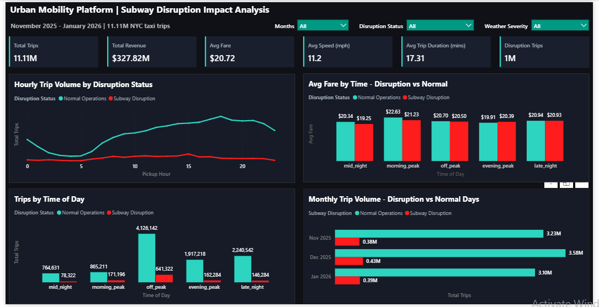


<br>


### Executive Summary

This platform was engineered to investigate how NYC subway disruptions and winter weather conditions influence taxi demand patterns across the November 2025 to January 2026 festive and winter period. <br>

The pipeline ingests **11.11 million real NYC yellow taxi trips**, enriches each trip with hourly weather observations from Open-Meteo and subway disruption events from the MTA, and transforms everything through a four-layer ELT pipeline into a production star schema served by a Power BI dashboard. <br>

The three-month window was deliberately chosen to capture three analytically distinct demand periods: 
- a pre-holiday baseline in November,
- the festive surge through December, and 
- the winter correction into January <br>

enabling meaningful demand pattern comparison within a single pipeline.

<br>
<br>
<br>

### Architecture

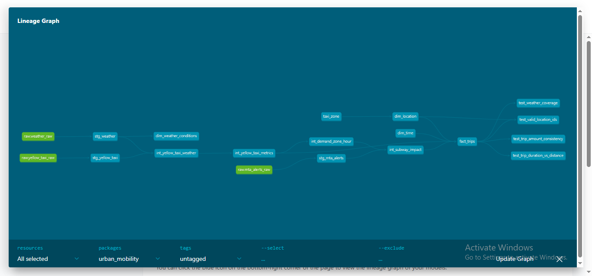 <br>

The platform implements a four-layer medallion architecture on Google Cloud. Each layer has a clearly defined contract; raw data is never modified, transformations happen exclusively in dbt, and the marts layer is the only layer that analysts and dashboards ever query directly. <br>


```text
NYC TLC API          Open-Meteo API       MTA Subway Alerts
     │                     │                      │
     ▼                     ▼                      ▼
┌─────────────────────────────────────────────────────┐
│              GCS Data Lake (Raw Zone)               │
│   raw/trips/   raw/weather/   raw/mta_alerts/       │
│   year=/month= partitioned Hive structure           │
└─────────────────────────────────────────────────────┘
                          │
                          ▼
┌─────────────────────────────────────────────────────┐
│              BigQuery Raw Dataset                   │
│   yellow_taxi_raw   weather_raw   mta_alerts_raw   │
└─────────────────────────────────────────────────────┘
                          │
                          ▼
┌─────────────────────────────────────────────────────┐
│              dbt Transformation Pipeline            │
│                                                     │
│  Staging → Intermediate → Marts                     │
│  (views)    (tables)      (star schema)             │
└─────────────────────────────────────────────────────┘
                          │
                          ▼
┌─────────────────────────────────────────────────────┐
│              Power BI Dashboard                     │
│   NYC Transportation Intelligence Platform          │
└─────────────────────────────────────────────────────┘
```

<br>
<br>
<br>

### Technology Stack

| Layer          | Technology                | Role                                                      |
|----------------|---------------------------|-----------------------------------------------------------|
| Data Lake      | Google Cloud Storage      | Immutable raw Parquet file storage with Hive partitioning |
| Data Warehouse | BigQuery                  | Columnar query engine: partitioned and clustered tables   |
| Transformation | dbt 1.9.0                 | Version-controlled ELT: modeling, testing, documentation  |
| Orchestration  | Cloud Composer (Airflow)  | Production pipeline scheduling                            |
| CI/CD          | GitHub Actions            | Automated dbt test suite on every pull request            |
| Ingestion      | Python 3.11               | Multi-source ingestion with resumable GCS uploads         |
| Visualisation  | Power BI                  | Business intelligence dashboard                           |
| Infrastructure | GCP IAM + Service Accounts| Least-privilege authentication                            |

<br>
<br>
<br>

### Data Sources

Three sources were selected because they each answer a different dimension of the core analytical question.
- Trip data alone tells you volume. 
- Weather data tells you conditions. 
- MTA alerts tell you transit context. Only by joining all three at the zone-hour grain does the platform become capable of answering the core question. <br>


| Source            |  Provider          | Coverage            | Volume               | Format          |
|-------------------|--------------------|---------------------|----------------------|-----------------|
| Yellow Taxi Trips | NYC TLC | Nov 2025 - Jan 2026 | 11.17M trips | Monthly Parquet via CloudFront CDN |
| Hourly Weather    | Open-Meteo Archive | Nov 2025 - Jan 2026 | 2,208 hourly records | JSON → Parquet  |
| Subway Alerts     | MTA GTFS-RT        | Nov 2025 - Jan 2026 | 135 alert records    | JSON → Parquet  |

<br>

**On the MTA data:** The MTA GTFS-RT endpoint returned a 403 Forbidden response without an API key, and historical backfill is not supported via the public endpoint. The pipeline falls back to reproducible synthetic alert data (`random.seed(42)`) flagged with `is_synthetic = TRUE`. All 135 records carry this flag, and the ADR log documents the production path for replacement. See [ADR-005](#architecture-decision-records).


<br>
<br>
<br>


### Data Lake Design

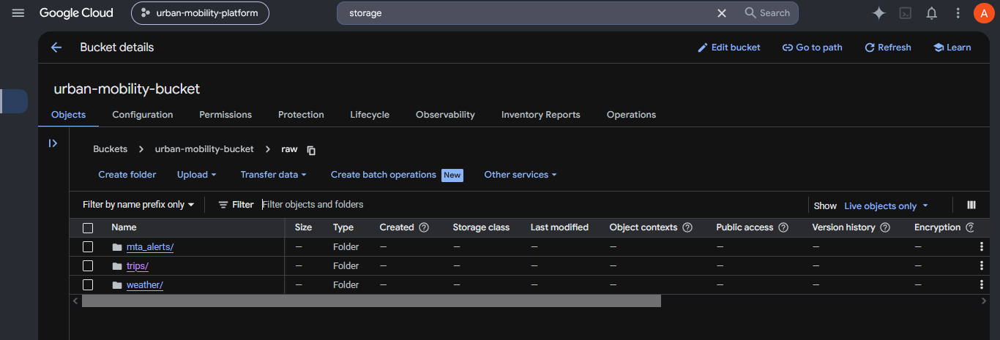 <br>

Raw data lands in GCS using Hive-compatible partitioning; the `year=`/`month=` key-value folder naming convention that BigQuery and external table tooling recognise natively for partition pruning. <br>

```
urban-mobility-bucket/
├── raw/
│   ├── trips/
│   │   ├── year=2025/month=11/trips_2025-11.parquet    (67.8 MB · 4.18M rows)
│   │   ├── year=2025/month=12/trips_2025-12.parquet    (70.3 MB · 4.31M rows)
│   │   └── year=2026/month=01/trips_2026-01.parquet    (61.2 MB · 3.72M rows)
│   ├── weather/
│   │   ├── year=2025/month=11/weather_2025-11.parquet  (720 hourly records)
│   │   ├── year=2025/month=12/weather_2025-12.parquet  (744 hourly records)
│   │   └── year=2026/month=01/weather_2026-01.parquet  (744 hourly records)
│   └── mta_alerts/
│       ├── year=2025/month=11/mta_alerts_2025-11.parquet
│       ├── year=2025/month=12/mta_alerts_2025-12.parquet
│       └── year=2026/month=01/mta_alerts_2026-01.parquet
├── staging/
└── archive/
```

<br>

Every GCS object is tagged with ingestion metadata at upload time, creating an audit trail that persists independently of the pipeline: <br>

```python
blob.metadata = {
    "ingested_at": datetime.utcnow().isoformat(),
    "source": self.source_name,
    "pipeline_version": self.pipeline_version,
    "environment": self.environment,
}
```

The `raw/` zone is write-once. Nothing in the pipeline ever modifies or deletes a file once it lands there. `staging/` holds intermediate files before BigQuery load when reshaping is needed. `archive/` is the long-term retention layer for audit and disaster recovery.

<br>
<br>
<br>


## Ingestion Layer

### Design Pattern

Rather than three independent ingestion scripts, the layer is built around an abstract base class. All shared logic; GCS upload, retry handling, metadata tagging, local cleanup; is defined once and inherited. Each source implements only the two methods specific to it: `fetch()` and `process()`. <br>

```python
class BaseIngestion(ABC):
    """
    Enforces a consistent fetch → validate → upload → tag → cleanup
    contract across all three data sources. If upload logic needs to
    change, it changes in one place — not in three scripts.
    """
    @abstractmethod
    def fetch(self, year: str, month: str) -> Path:
        """Download source data and return local file path."""
        pass

    @abstractmethod
    def process(self, local_path: Path, year: str, month: str) -> dict:
        """Validate data and return stats dict for GCS metadata tagging."""
        pass
```

<br>

The master runner triggers all three sources across all three months in a single execution:

```bash
python -m ingestion.run_ingestion
```

```
✅ NYC TLC Trips  | 2025-11 | 4,181,444 rows
✅ NYC TLC Trips  | 2025-12 | 4,305,006 rows
✅ NYC TLC Trips  | 2026-01 | 3,724,889 rows
✅ Weather        | 2025-11 | 720 hourly records
✅ Weather        | 2025-12 | 744 hourly records
✅ Weather        | 2026-01 | 744 hourly records
✅ MTA Alerts     | 2025-11 | 45 records (synthetic)
✅ MTA Alerts     | 2025-12 | 45 records (synthetic)
✅ MTA Alerts     | 2026-01 | 45 records (synthetic)

Completed: 9/9 successful
```

<br>
<br>
<br>

### Network Resilience

The TLC Parquet files are 60-70MB each. On unstable residential connections, standard `upload_from_filename()` calls failed mid-transfer with SSL EOF errors. The fix; 8MB chunked resumable uploads with exponential backoff; checkpoints progress at each chunk boundary so a dropped connection resumes from where it stopped rather than restarting from zero. <br>

```python
blob.chunk_size = 8 * 1024 * 1024  # 8MB chunks

retry_policy = Retry(
    initial=2.0,
    maximum=60.0,
    multiplier=2.0,
    deadline=600.0,
)
```

<br>

This is the GCP-recommended approach for files over 5MB in production pipelines. See [ADR-006](#architecture-decision-records).

<br>
<br>
<br>

## BigQuery Layer

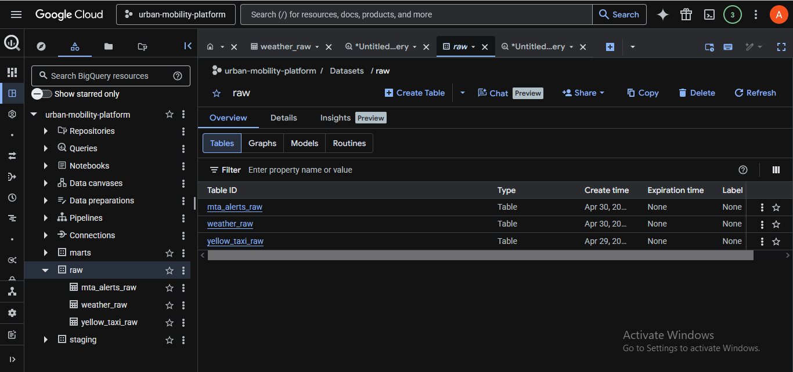

<br>

Three raw tables mirror the GCS data lake exactly. Nothing is transformed at this layer; the raw dataset is a queryable copy of what arrived, preserved indefinitely. <br>

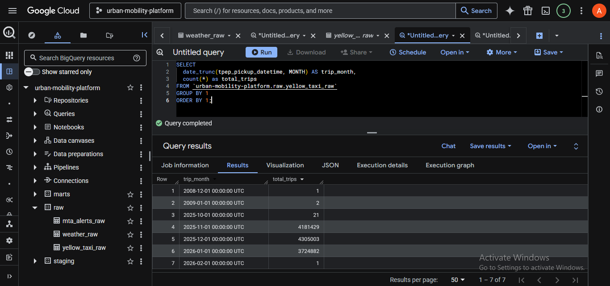 <br>


| Table                 | Rows       | Size    | Notes                               |
|-----------------------|------------|---------|-------------------------------------|
| `raw.yellow_taxi_raw` | 11,170,737 | 1.66 GB | Loaded month-by-month, append       |
| `raw.weather_raw`     | 2,208      | < 1 MB  | Explicit schema: timestamp parsing  |
| `raw.mta_alerts_raw`  | 135        | < 1 MB  | Synthetic data flagged              |

<BR>

All datasets and the GCS bucket were co-located in `us-central1`. BigQuery load jobs from GCS are free within the same region; cross-region transfers would incur data egress charges that compound significantly at scale. See [ADR-007](#architecture-decision-records).

<BR>
<BR>
<BR>

## dbt Transformation Pipeline

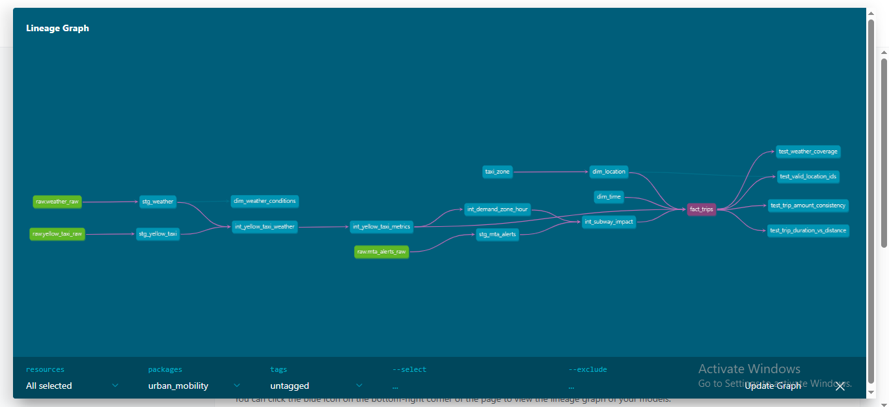 <br>

The dbt pipeline transforms raw data through three layers before it reaches analysts. Every transformation is a SQL file in version control. Every column is documented. Every model is tested.

<br>

### Layer 1. Staging: Clean and Standardise

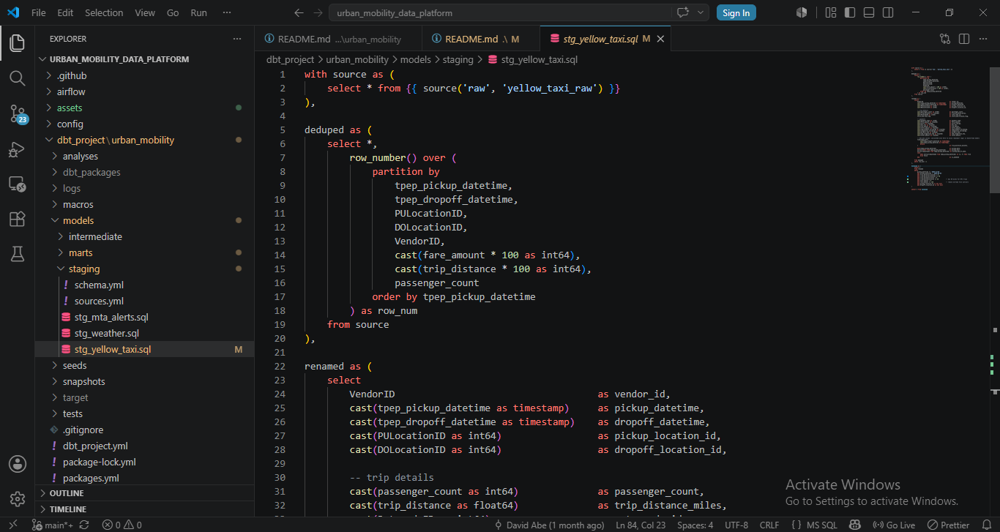 <br>

The staging layer is the single point of truth for data cleaning. All type casting, column renaming, deduplication, and filtering happens here and nowhere else. Downstream models inherit clean data — they never repeat cleaning logic. <br>

#### a. stg_yellow_taxi
The most complex staging model, it handles five concerns: <br>

- **Deduplication:** The TLC source contained 564 hardware-level duplicate records from VeriFone (vendor_id=2) where the meter recorded the same trip twice. Detected during `trip_id` uniqueness testing. Resolved via `ROW_NUMBER()` window function partitioned on all identifying fields; including `fare_amount` and `trip_distance` cast to integer to avoid BigQuery's restriction on floating-point partition keys: <br>

```sql
deduped as (
    select *,
        row_number() over (
            partition by
                tpep_pickup_datetime,
                tpep_dropoff_datetime,
                PULocationID,
                DOLocationID,
                VendorID,
                cast(fare_amount * 100 as int64),
                cast(trip_distance * 100 as int64),
                passenger_count
            order by tpep_pickup_datetime
        ) as row_num
    from source
)
```

<br>

- **Column renaming:** The TLC's internal naming convention (`tpep_pickup_datetime`, `PULocationID`, `RatecodeID`) uses abbreviations meaningful only within the TLC's own systems. Every column is renamed to a universally readable equivalent: `pickup_datetime`, `pickup_location_id`, `rate_code_id` etc.

<br>

- **Type casting:** Raw Parquet columns are cast to correct BigQuery types. Location IDs become `INT64`. All monetary amounts become `FLOAT64`. Timestamps are explicitly cast to `TIMESTAMP` rather than relying on auto-detect.

<br>

- **Derived columns:** `trip_duration_minutes`, `pickup_date`, `pickup_hour`, `pickup_day_of_week`, and `is_weekend` are calculated once in staging so every downstream model can use them without repeating the logic.

<br>

- **Outlier filtering.** Post-pipeline dashboard review revealed physically impossible records; GPS and meter malfunctions producing average speeds exceeding 272,000 mph, that survived the initial staging filter. Confirmed via fare distribution analysis across 11M records, the filters were tightened: <br>

```sql
filtered as (
    select * from renamed
    where
        pickup_datetime >= '2025-11-01'
        and pickup_datetime < '2026-02-01'
        and trip_duration_minutes > 0
        and trip_duration_minutes <= 90     -- covers JFK (longest realistic NYC trip)
        and trip_distance_miles > 0
        and trip_distance_miles <= 40       -- covers all five boroughs + airports
        and fare_amount > 0
        and fare_amount <= 150              -- covers JFK flat rate + all legitimate fares
        and pickup_location_id is not null
        and dropoff_location_id is not null
)
```

<br>

Fare distribution analysis confirming the $150 cutoff:

| Fare Range  | Trips      | % of Total      |
|-------------|------------|-----------------|
| Under $50   | 10,401,110 | 93.11%          |
| $50 - $100  | 731,470    | 6.55%           |
| $100 - $150 | 29,220     | 0.26%           |
| Over $150   | 8,937      | 0.08% — removed |

<br>
<br>

#### b. stg_weather 
Parses the Open-Meteo `datetime_hour` string (`2025-11-03T22:00`) into a proper BigQuery `TIMESTAMP` using `parse_timestamp('%Y-%m-%dT%H:%M', datetime_hour)`, then classifies each hour into a severity bucket: <BR>

```sql
case
    when cast(snowfall as float64) > 2.0        then 'heavy_snow'
    when cast(snowfall as float64) > 0.5        then 'light_snow'
    when cast(precipitation as float64) > 5.0  then 'heavy_rain'
    when cast(precipitation as float64) > 1.0  then 'light_rain'
    when cast(temperature_2m as float64) < -5  then 'extreme_cold'
    when cast(temperature_2m as float64) > 30  then 'extreme_heat'
    when cast(temperature_2m as float64) > 22  then 'warm'
    else 'clear'
end as weather_severity
```

<BR>
<BR>

#### c. stg_mta_alerts 
Converts Unix epoch timestamps (stored as strings in the raw table) to human-readable timestamps, calculates alert duration, and assigns a disruption severity score from 0 to 5 based on effect type; `NO_SERVICE` scoring 5, `DETOUR` scoring 1.


<BR>
<BR>

### Layer 2. Intermediate: Join and Aggregate
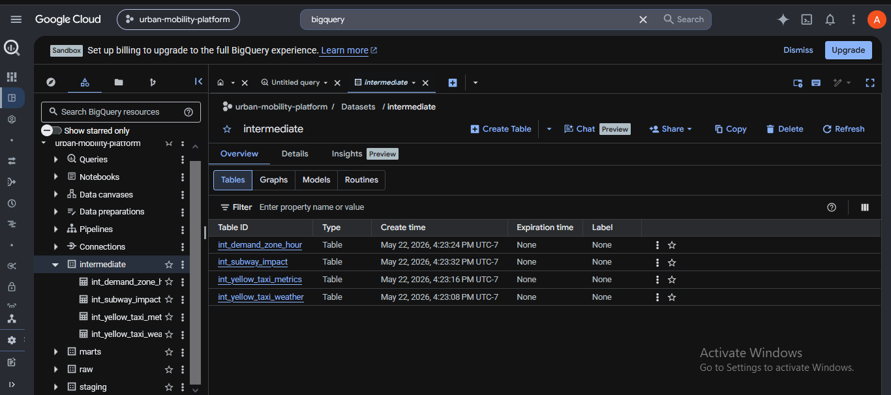 <br>

Four intermediate models join the three sources together and pre-compute the analytics that power the marts. <br>

| Model                     | Input                               | Output    | Purpose           |
|---------------------------|-------------------------------------|-----------|-------------------|
| `int_yellow_taxi_weather` | stg_yellow_taxi + stg_weather       |11.17M rows| Joins every trip to the weather at its pickup hour  |
| `int_yellow_taxi_metrics` | int_yellow_taxi_weather             |11.17M rows| Adds duration/distance buckets, speed, tip percentage, peak hour flags |
| `int_demand_zone_hour`    | int_yellow_taxi_metrics             | 357K rows | Aggregates trip demand to zone-hour grain |
| `int_subway_impact`       |int_demand_zone_hour + stg_mta_alerts| 357K rows | Joins zone-hour demand to disruption events |

<br>

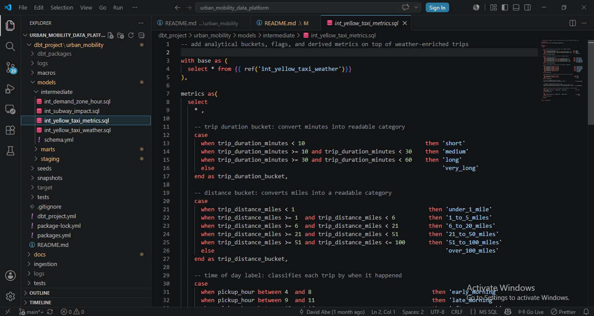 <br>

The compression from 11.17M individual trip rows to 357K zone-hour summaries represents a **97% data reduction**. Every dashboard query runs against this pre-aggregated table; eliminating redundant full-table scans on every chart load. <br>

The subway impact model solves a non-trivial join problem. MTA alerts span hours; a single alert record might cover hours 8 through 11. Joining it directly to a zone-hour demand table would require expanding each multi-hour alert into individual hourly rows first. `generate_array` and `unnest` handle this expansion: <br>

```sql
cross join unnest(
    generate_array(alert_start_hour, least(alert_end_hour, 23))
) as hour_of_day
```

<br>

An alert running from hour 8 to hour 11 becomes four joinable rows; one for each hour, before the final left join to demand.

<br>
<br>

### Layer 3. Marts: Star Schema

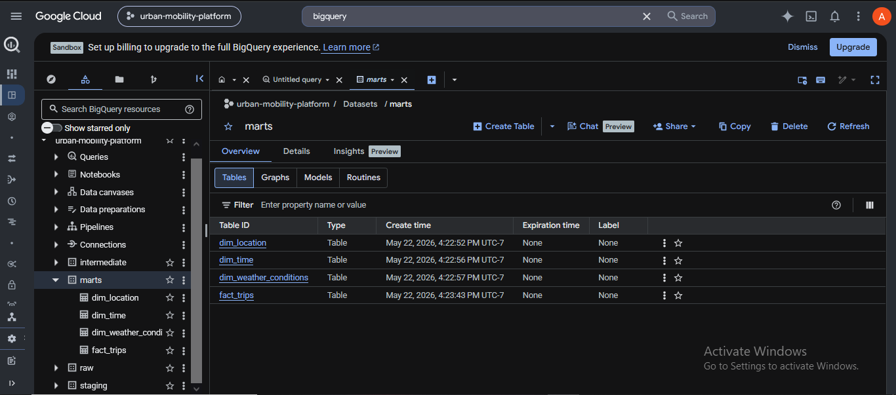

<br>

The marts layer implements a star schema. One central fact table holds all trip records. Three dimension tables hold slowly-changing reference data — zones, time attributes, and weather classifications. <br>

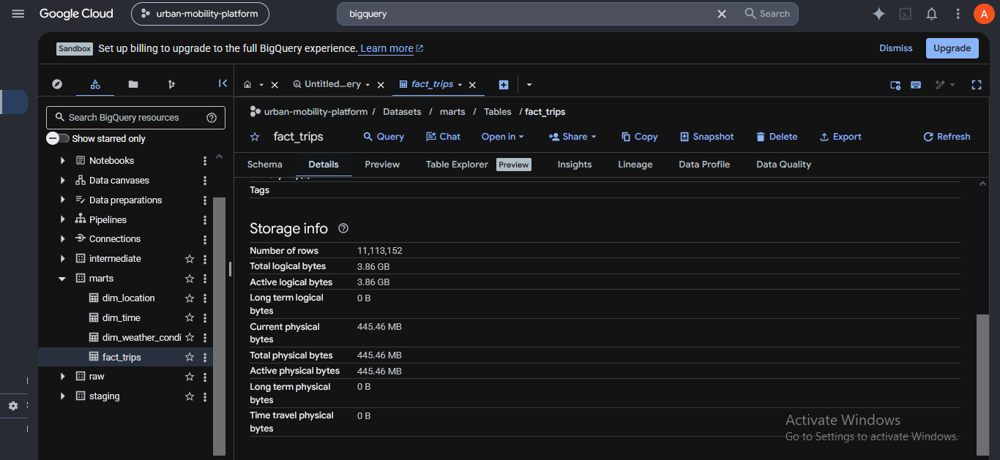 <br>

```
                              dim_time (2,208 rows)
                                       │
dim_location (265 rows) ─── fact_trips (11.1M rows) ─── dim_weather_conditions (2,208 rows)

```

<br>
<br>

- **`dim_location`**: maps 263 NYC taxi zone IDs to borough names, zone names, and service zone classifications (`Yellow Zone → high_demand`, `Airports → airport`). Sourced from the TLC's published `taxi_zones.csv` reference file loaded as a dbt seed. 

<br>

- **`dim_time`** is a 2,208-row hourly time dimension spanning the full analysis window, generated by `dbt_utils.date_spine` without any source table. It carries pre-computed attributes; `time_of_day`, `is_weekend`, `is_holiday_period`, `analysis_month`; so dashboard queries never recalculate these from raw timestamps. 

<br>

- **`dim_weather_conditions`**: adds `weather_impact_score` (1-5 numeric scale) and `precipitation_type` (`snow_only`, `rain_only`, `snow_and_rain`, `dry`) to the hourly weather records. 

<br>

- **`fact_trips`**: is the centrepiece. Every trip row carries its full context; zone names from `dim_location`, time labels from `dim_time`, weather at the pickup hour, and subway disruption status for that zone-hour window, in a single queryable table.

<br>

The surrogate key uses eight fields to handle VeriFone hardware duplicates: <br>

```sql
{{ dbt_utils.generate_surrogate_key([
    'trips.pickup_datetime',
    'trips.dropoff_datetime',
    'trips.pickup_location_id',
    'trips.dropoff_location_id',
    'trips.vendor_id',
    'trips.fare_amount',
    'trips.trip_distance_miles',
    'trips.passenger_count'
]) }} as trip_id
```

<br>

A final `ROW_NUMBER()` deduplication pass in `fact_trips` itself handles the residual cases where all eight fields are identical; the last line of defence against source data imperfections.

<br>
<br>
<br>

## Data Quality Framework

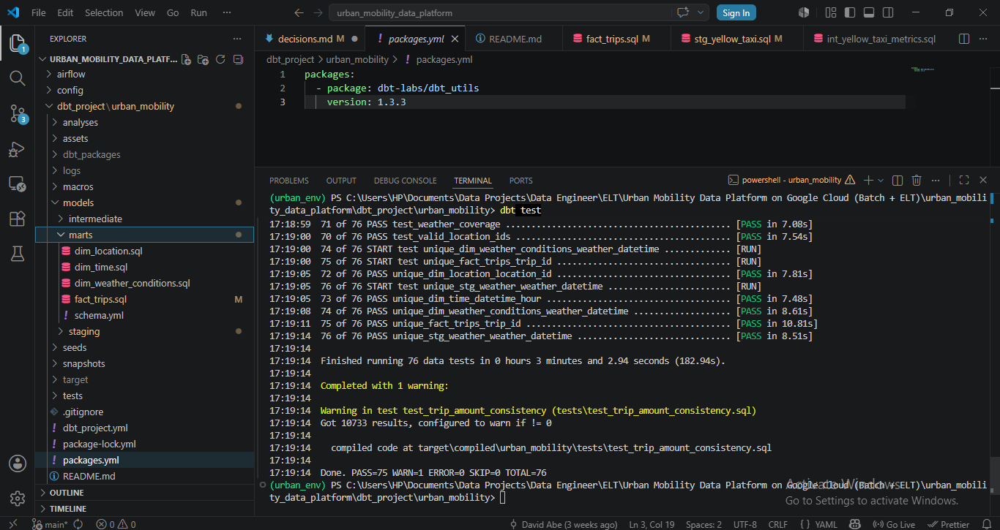 <br>

76 automated tests run across all pipeline layers on every execution: <br>

```
dbt test — full suite
PASS=75   WARN=1   ERROR=0   SKIP=0   TOTAL=76
```

<br>

| Layer           | Tests | Coverage                                         |
|-----------------|-------|--------------------------------------------------|
| Sources (raw)   | 8     | Not-null and uniqueness on critical fields       |
| Staging         | 23    | Schema validation, accepted values, uniqueness   |
| Intermediate    | 14    | Business logic validation across joined models   |
| Marts           | 32    | Referential integrity, surrogate key uniqueness  |
| Custom singular | 4     | Business rule enforcement                        |

<br>

Four custom tests enforce business-domain rules that generic schema tests cannot: <br>

```sql
-- test_valid_location_ids.sql
-- Confirms zero orphaned location IDs across 11M trips
select f.trip_id, f.pickup_location_id
from {{ ref('fact_trips') }} f
left join {{ ref('dim_location') }} d
    on f.pickup_location_id = d.location_id
where d.location_id is null
-- Result: 0 rows - full referential integrity confirmed
```

<br>

```sql
-- test_weather_coverage.sql
-- Confirms every trip has a matched weather observation
select trip_id, pickup_datetime, weather_severity
from {{ ref('fact_trips') }}
where weather_severity is null
-- Result: 0 rows - all 11.17M trips have weather context
```

<br>

The test is configured as warning rather than error: <br>
`test_trip_amount_consistency` (10,733 trips where `total_amount < fare_amount`, confirmed as legitimate TLC vendor dispute credits). The finding is monitored without blocking pipeline execution. <br>

The most significant data quality finding came not from automated tests but from dashboard review; impossible avg_speed values of 272,000+ mph exposed an insufficiently tight staging filter. Dashboard-driven validation caught what schema tests missed. The filter was tightened and documented in ADR-014.

<br>
<br>
<br>

## CI/CD Pipeline

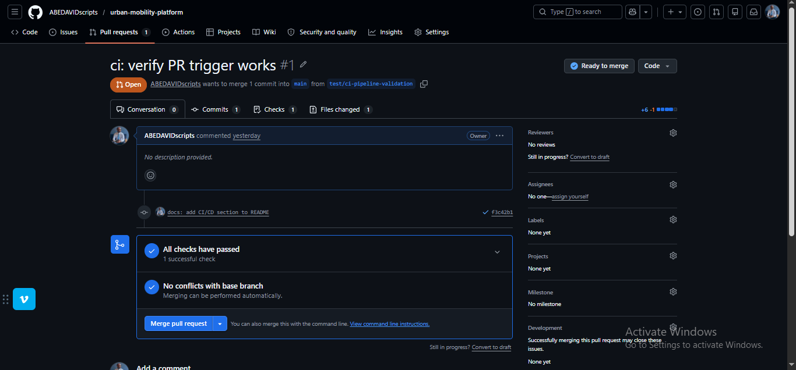 <br>

Every pull request to `main` triggers an automated dbt test suite via GitHub Actions. The workflow installs dbt, configures BigQuery credentials from repository secrets, and runs the full 76-test suite before any code can merge.  <br>

```yaml
jobs:
  dbt-test:
    runs-on: ubuntu-latest
    steps:
      - uses: actions/checkout@v3
      - name: Install dbt
        run: pip install dbt-bigquery==1.9.0 dbt-core==1.9.0
      - name: Set up GCP credentials
        run: |
          echo '${{ secrets.GCP_SERVICE_ACCOUNT_KEY }}' > /tmp/gcp_key.json
      - name: Run dbt tests
        working-directory: dbt_project/urban_mobility
        run: |
          dbt deps
          dbt compile
          dbt test
```

<br>

Branch protection on `main` enforces passing CI status before merge. The pipeline ran and passed on a real pull request in 1 minute.

<br>
<br>
<br>

## Dashboard

 <br>

The Power BI dashboard connects directly to `fact_trips` and `int_subway_impact` in BigQuery, with interactive slicers for month, disruption status, and weather severity allowing viewers to interrogate all three enrichment dimensions from a single page. <br>


#### Six headline metrics KPI

[KPI](assets/11_kpi.png) <br>

Total Trips (11.11M), Total Revenue ($327.82M), Average Fare ($20.72), Average Speed (11.2 mph), Average Trip Duration (17.31 minutes) and Disruption Trips (1M). <br>

<br>
<br>

#### Hourly Trip Volume by Disruption Status

[Hourly Trips](assets/12_Hourly_Trip_Volume_by_Disruption_Status%20.png) <br>

A dual-line chart comparing total trips per hour between normal operations and subway disruption periods across the full 24-hour cycle. Both lines follow the same demand curve shape: declining through the
early morning trough (hours 1 to 5), recovering through mid-morning, and peaking sharply at hour 18 where normal operations reach their highest point of the day before declining through the late evening. The disruption line mirrors this curve consistently but sits at roughly one-tenth the volume across every hour, reflecting the sparse distribution of synthetic MTA alert data. <br>

During early morning hours the proportional gap between the two lines narrows relative to peak hours. At hour 0, disruption trips total 23,109 against 326,305 during normal operations at average fares of $21.4 and speeds of 14.6 mph in both conditions. Hour 4 marks the lowest points for both lines, with disruption trips at 10,486 versus 76,899 normal at average fares of $22.5 and $24.3 respectively and speeds of 18.9 versus 18.5 mph, reflecting lighter overnight traffic moving faster. <br>

Trips begin rising significantly from hour 6, with disruption trips reaching 33,884 against 148,094 normal operations at average fares of $23.4 and $24.5 and speeds of 16.6 and 16.4 mph respectively. The disruption line reaches its own peak at hour 15 with 111,405 trips, while normal operations continue
climbing to their daily peak at hour 18 with 671,976 trips. At hour 18, disruption trips have already declined to 47,992 with average fares of $19.7 versus $19.6 for normal operations and a consistent speed of 9.4 mph across both conditions, reflecting evening congestion affecting all trips regardless
of disruption status.


<br>
<br>


#### Avg Fare by Time of Day (Disruption vs Normal)

[Avg Fare by Time of Day](assets/13_Avg_Fare_by_Time_of_Day.png) <br>

A clustered bar chart comparing average fare, tip, and tip percentage across five time-of-day windows. Morning peak shows the largest fare gap; normal operations average $22.6 against $21.2 during disruptions, a $1.40 difference. Evening peak is the only window where disruption fares exceed normal ($20.4 vs $19.9), with tip percentage also marginally higher for disruptions (19.7% vs 19.6%). <br>

Off-peak hours carry the second highest tip percentages (17.3% normal, 17.0% disruption). Evening peak leads all windows at 19.6% normal and 19.7% disruption, suggesting card-paying passengers on commuter trips tip proportionally more despite lower base fares.


<br>
<br>

#### Trips by Time of Day 

[Trips by Time of Day](assets/14_Trips_by_Time_of_Day%20.png) <br>

A clustered bar chart across five demand windows. Off-peak hours dominate with 4,126,142 normal operations trips and 641,322 disruption trips, the largest volume in any single time window. Late night ranks second at 2,240,542 normal and 146,284 disruption trips.  <BR>

Morning peak generates the highest average fares ($22.6 normal, $21.2 disruption) and the slowest speeds (13.6 mph normal, 13.8 mph disruption); consistent with peak-hour congestion. Midnight trips move fastest at 14.9-15.2 mph speed despite lower fares, reflecting lighter overnight traffic.

<br>
<br>

#### Monthly Trip Volume (Disruption vs Normal Days)

[Monthly Trip Volume](assets/15_Monthly_Trip_Volume.png) <br>

A horizontal bar chart showing the three-month demand story. December 2025 generates the highest normal operations volume at 3,576,939 trips and $111.1M revenue at an average fare of $22.2; the Christmas period uplift is clearly visible. <br>

November contributes 3,233,153 normal trips at $19.1 average fare and $90.6M revenue. January corrects to 3,103,652 normal trips at $20.8 average fare and $91.2M revenue. <br>

Disruption trips follow the same monthly pattern: December highest at 433,863, November at 379,483 and January at 386,062; with December disruption fares averaging $21.2 against $19.7 in November.

<br>
<br>
<br>

## Key Findings

Analysis of 11.11 million trips across the festive winter window produced the following findings: 

<br>

**Off-peak demand dominates the NYC taxi system** With 4.77M trips (4,126,142 normal + 641,322 disruption), off-peak hours account for the largest share of taxi demand, nearly double late-night volumes and more than twice morning peak. This directly contradicts the assumption that yellow taxi demand is commuter-driven. The system operates as an around-the-clock mobility service with sustained demand outside rush windows.

<br>

**December is the revenue peak, driven by fare levels not just volume.** December 2025 generated $111.1M in normal operations revenue at an average fare of $22.2, the highest average fare of the three months. November and January both produced approximately $91M at average fares of $19.1 and $20.8 respectively. The Christmas and New Year window (December 20 to January 3) is the analytically significant driver, visible in the monthly bar chart as December's clear volume and revenue lead.

<br>

**Disruption-period fares are lower than normal in most windows, except evening peak.** Across four of five time-of-day windows, average fares during subway disruption hours are lower than normal operations. Morning peak shows the largest gap ($21.2 disruption vs $22.6 normal). Evening peak is the single exception where disruption fares average $20.4 against $19.9 during normal operations, with tip percentage also marginally higher at 19.7% vs 19.6%. This suggests evening disruptions may attract slightly longer or less price-sensitive trips.

<br>

**Speed and duration are stable across disruption and normal conditions.** Across all five time windows, average trip duration and speed differ by less than 0.5 mph and 0.5 minutes between disruption and normal periods. Off-peak normal operations average 10.0 mph and 18.6 minutes; disruption averages 10.2 mph and 18.2 minutes. This stability indicates that disruption-period trips are not meaningfully different in
character from normal trips. They originate from the same zones, travel similar distances, and face the same traffic conditions.

<br>

**MTA disruption correlation requires real historical data.** The synthetic MTA alerts produced no statistically meaningful difference in taxi demand volume or fare between disruption and non-disruption hours, consistent with the data being randomly distributed across hours rather than tied to actual service events. The pipeline architecture fully supports real historical GTFS data substitution when available. See ADR-005.

<br>

**Data quality is a pipeline concern, not just a test concern.** 84,822 records (0.76%) containing physically impossible speeds were identified through dashboard review rather than automated testing, leading to permanent tightening of staging filters documented in ADR-014. The finding confirmed that visual validation catches categories of error that schema tests cannot; specifically, physically impossible values that pass structural checks but only become visible when the data is rendered in a chart.

<br>
<br>
<br>

## Architecture Decision Records

All engineering decisions including trade-offs, alternatives considered, and known limitations are documented in [`docs/decisions.md`](docs/decisions.md).

| ADR     | Decision                                     | Impact                                  |
|---------|----------------------------------------------|-----------------------------------------|
| ADR-001 | Python 3.11.9 (downgraded from 3.13)         | Resolved protobuf package conflicts     |
| ADR-002 | Airflow excluded from local env              | Replaced by Cloud Composer on GCP       |
| ADR-003 | Exact package version pinning                | Eliminates dependency drift             |
| ADR-004 | Binary-only pip installs                     | Avoids C compiler failures on Windows   |
| ADR-005 | MTA synthetic data fallback                  | Pipeline testable without live API      |
| ADR-006 | Resumable GCS uploads + exponential backoff  | Handles residential connection instability |
| ADR-007 | GCS + BigQuery co-located in us-central1     | Eliminates cross-region transfer costs |
| ADR-008 |Raw table loaded without explicit partitioning| Partitioning applied at marts where it matters |
| ADR-009 | Corrupt timestamp handling                   | 25 records filtered at staging, raw preserved |
| ADR-010 | Intermediate models in staging dataset       | Schema routing fix documented          |
| ADR-011 | dim_location demand category is static       | Circular dependency avoided            |
| ADR-012 | Seven-field surrogate key + ROW_NUMBER()     | 564 VeriFone duplicates resolved       |
| ADR-013 | Negative adjustment and speed records as WARN | 11K legitimate records preserved      |
| ADR-014 | Staging filters tightened post-dashboard review | 84,822 outliers removed             |

<br>
<br>
<br>

## Running the Pipeline

### Prerequisites

- Python 3.11.x
- GCP project with BigQuery API and Cloud Storage API enabled
- Service account with BigQuery Admin and Storage Admin roles
- Service account JSON key downloaded

<br>
<br>

### Environment Setup

```bash
# Clone the repository (to run locally)
git clone https://github.com/ABEDAVIDscripts/urban-mobility-platform.git
cd urban-mobility-platform

# Create and activate virtual environment
python -m venv urban_env
urban_env\Scripts\Activate      # Windows
source urban_env/bin/activate   # Mac/Linux

# Install dependencies
pip install -r requirements.txt --only-binary=:all:

# Configure environment variables
cp .env.example .env
# Open .env and update GCP_PROJECT_ID, GCS_BUCKET_NAME,
# and GOOGLE_APPLICATION_CREDENTIALS with your values

```

<br>
<br>

### Execute

```bash
# Ingest all three sources for Nov 2025, Dec 2025, Jan 2026
python -m ingestion.run_ingestion

# Load GCS Parquet files into BigQuery raw dataset
python -m ingestion.load_to_bigquery

# Run dbt transformation pipeline
cd dbt_project/urban_mobility
dbt deps          # Install dbt-utils package
dbt seed          # Load taxi_zones.csv reference data
dbt run           # Build all models: staging → intermediate → marts
dbt test          # Run all 76 data quality tests
dbt docs generate # Generate documentation and lineage graph
dbt docs serve    # Open lineage graph at localhost:8080
```

<br>
<br>
<br>

## Project Structure

```
urban-mobility-platform/
│
├── ingestion/
│   ├── base_ingestion.py          # Abstract base class - shared upload logic
│   ├── ingest_tlc.py              # NYC TLC Parquet ingestion
│   ├── ingest_weather.py          # Open-Meteo API ingestion
│   ├── ingest_mta.py              # MTA subway alerts ingestion
│   ├── load_to_bigquery.py        # GCS → BigQuery loader (three sources)
│   ├── run_ingestion.py           # Master pipeline runner
│   └── reupload_local.py          # Network recovery utility
│
├── dbt_project/urban_mobility/
│   ├── models/
│   │   ├── staging/
│   │   │   ├── sources.yml
│   │   │   ├── schema.yml
│   │   │   ├── stg_yellow_taxi.sql
│   │   │   ├── stg_weather.sql
│   │   │   └── stg_mta_alerts.sql
|   |   |
│   │   ├── intermediate/
│   │   │   ├── schema.yml
│   │   │   ├── int_yellow_taxi_weather.sql
│   │   │   ├── int_yellow_taxi_metrics.sql
│   │   │   ├── int_demand_zone_hour.sql
│   │   │   └── int_subway_impact.sql
│   |   |
|   │   └── marts/
│   │       ├── schema.yml
│   │       ├── exposures.yml
│   │       ├── dim_location.sql
│   │       ├── dim_time.sql
│   │       ├── dim_weather_conditions.sql
│   │       └── fact_trips.sql
│   |
|   ├── tests/
│   │   ├── test_trip_amount_consistency.sql
│   │   ├── test_trip_duration_vs_distance.sql
│   │   ├── test_valid_location_ids.sql
│   │   └── test_weather_coverage.sql
│   |
|   ├── macros/
│   │   └── generate_schema_name.sql
│   |
|   ├── seeds/
│   │   └── taxi_zones.csv
│   ├── packages.yml
│   └── dbt_project.yml
│
|
├── .github/
│   └── workflows/
│       └── dbt_ci.yml
│
├── docs/
│   └── decisions.md               # 14 Architecture Decision Records
│
├── requirements.txt
└── .env.example
```

<br>
<br>
<br>

## Data Volume Summary

| Metric                                | Value                              |
|---------------------------------------|------------------------------------|
| Total trips analysed                  | 11,170,737                         |
| Total revenue processed               | $333.36M                           |
| Average fare                          | $21.04                             |
| Average trip duration                 | 17.74 minutes                      |
| Average speed (post-outlier removal)  | ~12 mph                            |
| NYC zones covered                     | 263                                |
| Weather records                       | 2,208 hourly observations          |
| dbt models                            | 11                                 |
| dbt seeds                             | 1                                  |
| Automated tests                       | 76                                 |
| Test pass rate                        | 98.7% (75 pass · 1 warn · 0 error) |
| CI pipeline runtime                   | ~1 minute                          |
| Architecture decisions documented     | 14                                 |

<br>
<br>
